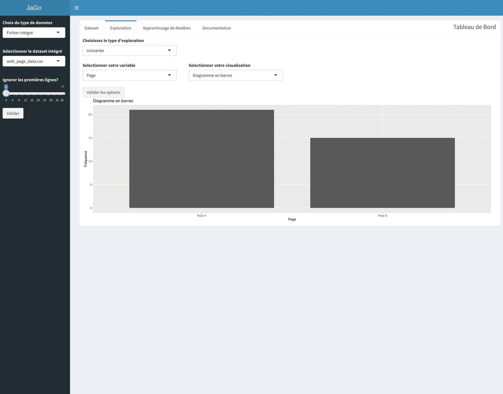

<h1 align="center">⚡️ Mlapp-RShiny</h1>

<h4 align="center">
    <p>
        <a href="#A-propos">A propos</a> •
        <a href="#Objectif">Objectif</a> •
        <a href="#Les-fonctionnalités">Les fonctionnalités</a> •
        <a href="#Lancement">Lancement</a> •
    <p>
</h4>

<h3 align="center">
    <a href="https://www.iledefrance.fr/"></a>
</h3>

# A propos
Exploration de données et apprentissage de modèles supervisés avec l'application RShiny



# Objectif
 **Mlapp-RShiny** est une application permettant une exploration et l'application de modèle de Machine Learning sur les datasets intégrés. Vous avez également la possibilité d'interagir avec l'application au travers de vos propres datasets.

# Les fonctionnalités
- Import de données utilisateurs. Possibilité d'utiliser les données intégrées.
- Preprocessing (Typage, Imputation, Normalisation, Ré-équilibrage etc...)
- Analyse exploratoire univariée/bivariée/multivariée
- Apprentissage de modèles supervisé

# Documentation
Afin de bien prendre en main l'application référez-vous aux ressource suivante:
- L'onglet ```Documentation``` vous donne un descriptif des éléments visuels présentes dans le dashbord.
- Un cas pratique spécifique dans le répertoire documentation, vous permettra de mener de bout en bout une étude d'import des données jusqu'à l'application de modèles de ML :)  

# Lancement
To launch the application, you can follow these steps:

1. Clone the repository:
    ```
    git clone https://github.com/goamegah/RShiny-MLa
    ```

2. Navigate to the project directory:
    ```
    cd Mlapp-RShiny/app
    ```

3. Build the Docker image:
    ```
    docker build -t mlapp-rshiny .
    ```

4. Run the Docker container:
    ```
    docker run -p 3838:3838 mlapp-rshiny
    ```

5. Access the application in your web browser at `http://localhost:3838`.

Please note that you need to have Docker installed on your machine to run the application.

#### Notes 
Un Dockerfile est présent pour ce projet mais l'application est déjà conteneurisée.

Vous pouvez la retrouver sur : https://hub.docker.com/repository/docker/goamegah/edams-rshiny

Le port d'écoute est 3838, un mapping de port est nécessaire pour pouvoir y accéder depuis l'extérieur.